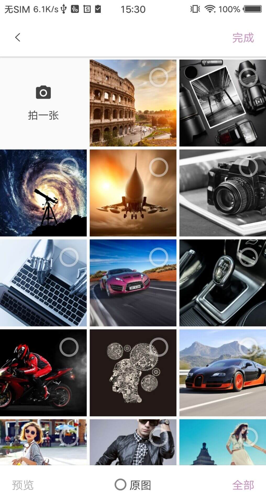
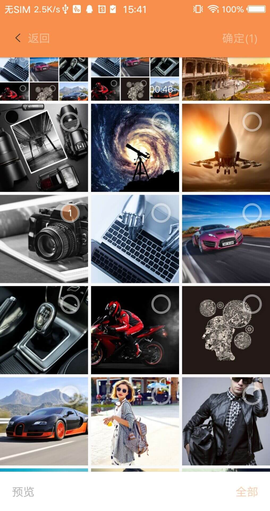
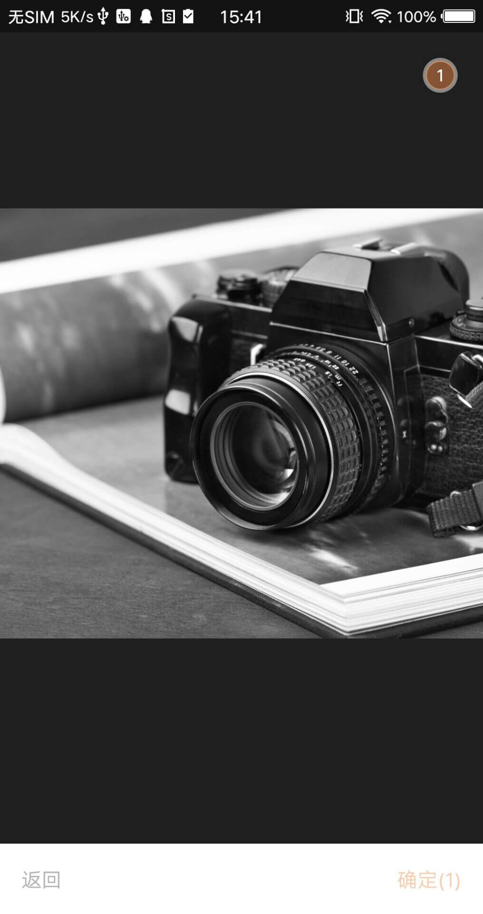
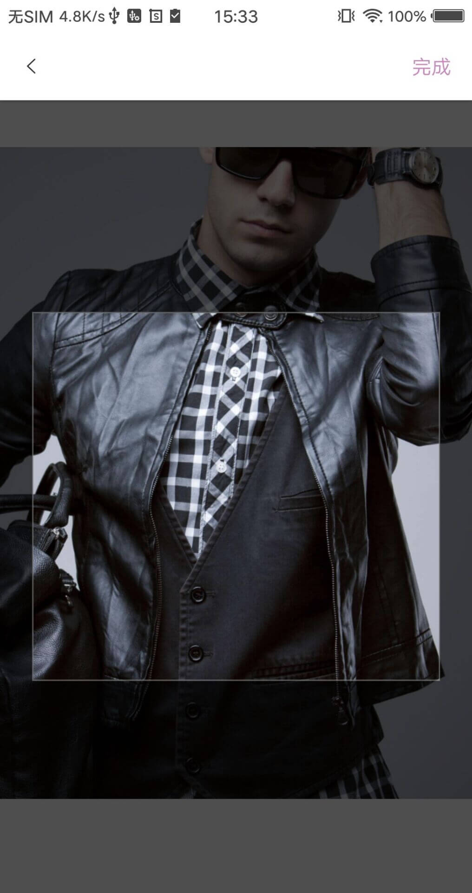
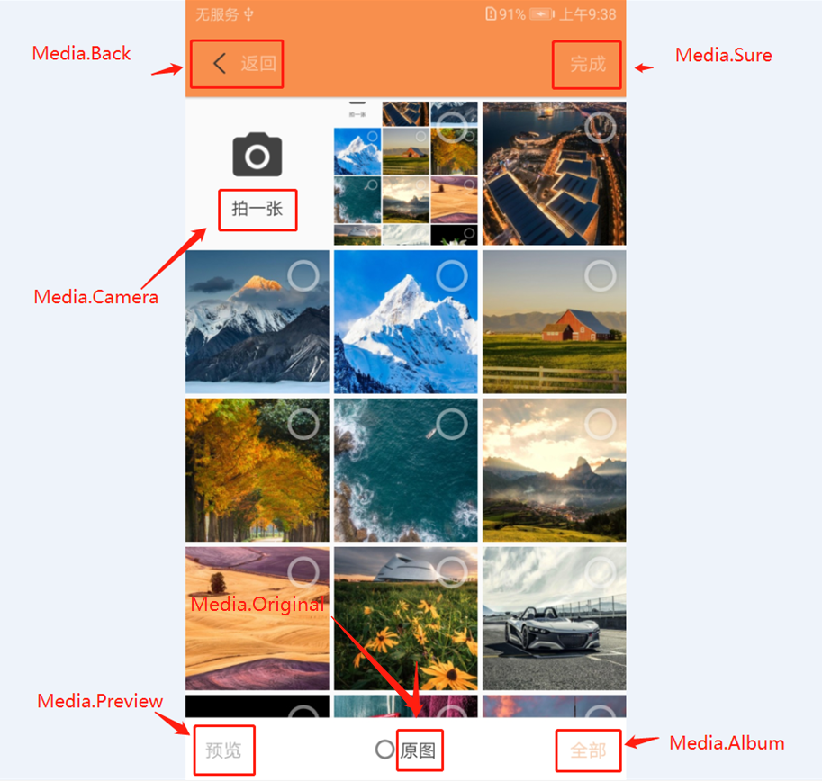
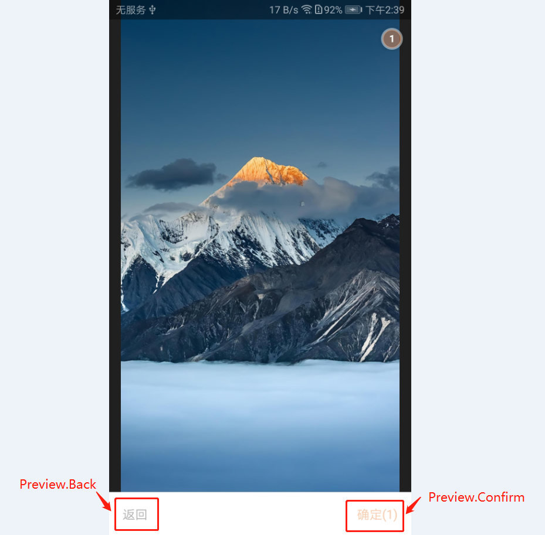

[Matisse-kotlin地址](https://github.com/NFLeo/Matisse-Kotlin)

首先感谢：
Matisse核心功能：[https://github.com/zhihu/Matisse](https://github.com/zhihu/Matisse)

裁剪提供者：廖子尧  github地址：[https://github.com/jeasonlzy](https://github.com/jeasonlzy) 

图片压缩提供者：[https://github.com/nanchen2251](https://github.com/nanchen2251)

# 版本更新记录
2019-11-10 (2.0.1)
1. 修复裁剪结果尺寸异常

2019-11-4 (2.0)
1. 相机单独提取
2. 支持默认选中，可传入上次选中的项（通过图片cursor id或uri string对比）
    注：不支持裁剪带回的图片，裁剪带回的图片无id和uri
```
.setLastChoosePicturesIdOrUri(selectedPathIds as ArrayList<String>?)
```
3. 修复压缩为空带回崩溃

2019-10-29 (1.2.3)
1. 修复相册弹窗高度不准确问题
2. 支持压缩配置，外部添加开关  api:[isInnerCompress]
3. 完善未选中资源时各按钮点击添加提示
4. 修复不同设备返回的媒体类型表示不一致（如：JPEG image/jpeg）
5. 去除[api setStatusIsDark], 外部处理状态栏，见[api setStatusBarFuture]

2019-10-28 (持续更新 待发布)
1. 支持相机拍照完成后多选
2. 扩展提示方法，支持使用外部自定义弹窗
3. 支持外部处理状态栏，去除项目中原[ImmersionBar]库
```
.setStatusBarFuture(object : MFunction<BaseActivity> {
                override fun accept(params: BaseActivity, view: View?) {
                    // 外部设置状态栏
                    ImmersionBar.with(params)?.run {
                        statusBarDarkFont(isDarkStatus)
                        view?.apply { titleBar(this) }
                        init()
                    }

                    // 外部可隐藏Matisse界面中的View
                    view?.visibility = if (isDarkStatus) View.VISIBLE else View.GONE
                }
            })
```
4. 按官方方式适配Android Q

2019-10-21 (1.2.2)
1. 修复方形裁剪图片变形问题
2. 优化单选/多选刷新问题

2019-10-18 (1.2.0)
1. 迁移到androidx
2. 修复并支持图片与视频混合选择
```
设置选择单一类型媒体，示例如下
Matisse.choose(MimeTypeManager.ofAll())
                .maxSelectable(3)
或者
Matisse.choose(MimeTypeManager.ofAll(), true)
                .maxSelectable(3)

设置选择混合类型媒体，示例如下
Matisse.choose(MimeTypeManager.ofAll(), false)
                .maxSelectablePerMediaType(4, 2)

说明：
mediaTypeExclusive true 单一媒体类型选择
     读取maxSelectable属性作为最大值
mediaTypeExclusive false
     读取maxImageSelectable和maxVideoSelectable属性分别作为最大值
```
3. 修改单/多选逻辑
	* 单选支持重新选定，不支持计数方式
	* 多选不支持重新选定，选满外部给出提示方式，支持计数与选中方式
4. 提示方式外部实现
```
SelectionCreator.setNoticeConsumer(object : NoticeConsumer {
                                 override fun accept(
                                     context: Context, noticeType: Int, title: String, message: String
                                 ) {
                                     // 外部提示，可外部定义样式
                                     showToast(context, noticeType, title, message)
                                 }
                             })
```

2019-10-16
1. 完善主题扩展，并提供图片说明


# Matisse
本项目为知乎原项目kotlin改写版本（2018/9月版本），由于项目纯图片选择库与[Matisse](https://github.com/zhihu/Matisse)UI风格有较大差异，为方便个人使用顺手便对[Matisse](https://github.com/zhihu/Matisse)进行Kotlin翻译，主要对原项目进行部分UI层面改写、已发现bug的修改、新功能添加。
*主要修改内容为：*
```
1. 优化相册选择。
2. 优化单选策略。
3. 添加圆形与方形裁剪。
4. 图片选择后压缩，不失真条件下高比率压缩。
5. 增加主题修改，基本可保证定制成与自身项目风格一致
6. 支持设置状态栏颜色 需依赖[ImmersionBar](https://github.com/gyf-dev/ImmersionBar)
    1.2.2之后版本去除内部ImmersionBar处理


* 注：裁剪成功后只返回裁剪后图片的绝对路径，不返回Uri，需自行转换

具体调用查看 SelectionCreator.java

关于打包报错问题：

使用：
1. gradle中添加 implementation 'com.nfleo:MatisseKotlin:2.0.1'
2. AndroidManifest.xml中添加以下代码
* 注：注意provider androidx的差别
        <provider
            android:name="androidx.core.content.FileProvider"
            android:authorities="${applicationId}.fileprovider"
            android:exported="false"
            android:grantUriPermissions="true">
            <meta-data
                android:name="android.support.FILE_PROVIDER_PATHS"
                android:resource="@xml/file_paths_public"/>
        </provider>

3. 6.0+需处理权限
The library requires two permissions:
    - `android.permission.READ_EXTERNAL_STORAGE`
    - `android.permission.WRITE_EXTERNAL_STORAGE`

4. 为适配7.0，,项目manifest的privider标签下 paths文件中添加
    文件名称为file_paths_public（名字随意取，但需与AndroidManifest.xml中引用保持一致）
    <external-path  name="my_images" path="Pictures"/>

5. 项目gradle中添加

// 具体版本需自行配置(最外层build.gradle)
ext {
    compileSdkVersion = 28

    minSdkVersion = 19
    targetSdkVersion = 28

    appcompat = '1.1.0'
    material = '1.0.0'
    recyclerview = '1.0.0'
    glide = '4.7.1'
    constraintlayout = '1.1.3'
}
```

| Default Style                  | Other Style Preview                  | Preview                          |
|:------------------------------:|:---------------------------------:|:--------------------------------:|
| |  | |

| Circle Crop                    | Square Crop                       |
|:------------------------------:|:---------------------------------:|
| |  |


#### Simple usage snippet
------

### 配置主题.
| Media theme                    | Preview theme                       |
|:------------------------------:|:---------------------------------:|
| |  |


使用套路与原项目一致，只是多增加了一些参数，另外定制时需配置所提供的所有参数。
使用主题时可直接使用Matisse.Default， 或者在自己项目中另写style继承自Matisse.Default，修改自己所需属性，如下
```
app/style.xml
    <style name="CustomMatisseStyle" parent="Matisse.Default">
        <item name="Media.Back.text">@string/back</item>
        <item name="Media.Sure.text">@string/sure</item>
        <item name="Media.Preview.text">@string/preview</item>
        <item name="Media.Original.text">@string/original</item>
        <item name="Media.Album.text">@string/album</item>
        <item name="Media.Camera.text">@string/camera</item>
    </style>
```

```
matisse/style.xml
    <style name="Matisse.Default" parent="Theme.AppCompat.Light.NoActionBar">
        <!--状态栏相关-->
        <item name="colorPrimary">@color/primary</item>
        <item name="colorPrimaryDark">@color/primary_dark</item>

        <!--顶部导航条高度-->
        <item name="navigation.height">@dimen/navigation_height</item>
        <!--顶部导航条背景色-->
        <item name="navigation.background">@color/navigation_bg</item>
        <!--顶部导航条返回按钮资源图-->
        <item name="navigation.backRes">@drawable/icon_arrow_right_white</item>
        <!--图片预览界面背景色-->
        <item name="preview.background">@color/preview_bg</item>

        <!--底部工具栏背景色-->
        <item name="bottomToolbar.bg">@color/bottomTool_bg</item>
        <!--底部工具栏高度-->
        <item name="bottomToolbar.height">@dimen/bottom_tool_height</item>

        <!--返回按钮文字 当无文字是可设置为空字符串 如下-->
        <item name="Media.Back.text">@string/button_null</item>
        <!--返回按钮颜色-->
        <item name="Media.Back.textColor">@color/text_back</item>
        <!--返回按钮文字大小-->
        <item name="Media.Back.textSize">@dimen/text_back</item>

        <item name="Media.Sure.text">@string/button_sure</item>
        <!--确定按钮颜色-->
        <item name="Media.Sure.textColor">@color/text_sure</item>
        <!--确认按钮文字大小-->
        <item name="Media.Sure.textSize">@dimen/text_sure</item>

        <item name="Media.Preview.text">@string/button_preview</item>
        <!--预览按钮颜色-->
        <item name="Media.Preview.textColor">@color/text_preview</item>
        <!--预览按钮文字大小-->
        <item name="Media.Preview.textSize">@dimen/text_preview</item>

        <item name="Media.Original.text">@string/button_original</item>
        <!--原图选择控件文字颜色-->
        <item name="Media.Original.textColor">@color/text_original</item>
        <!--原图按钮文字大小-->
        <item name="Media.Original.textSize">@dimen/text_original</item>

        <item name="Media.Album.text">@string/album_name_all</item>
        <!--查看全部相册文件夹按钮颜色-->
        <item name="Media.Album.textColor">@color/text_album</item>
        <!--查看全部相册按钮文字大小-->
        <item name="Media.Album.textSize">@dimen/text_album</item>
        <!--相册文件夹内部列表item颜色-->
        <item name="Media.Album.Item.textColor">@color/text_item_album</item>
        <!--查看全部相册内item文字大小-->
        <item name="Media.Album.Item.textSize">@dimen/text_item_album</item>

        <!--列表中可拍照状态下相机item文字颜色-->
        <item name="Media.Camera.textColor">@color/text_camera</item>
        <!--列表中可拍照状态下相机item文字大小-->
        <item name="Media.Camera.textSize">@dimen/text_camera</item>

        <!--选中控件背景色-->
        <item name="item.checkCircle.backgroundColor">@color/item_checkCircle_backgroundColor</item>
        <!--选中控件圆环边框颜色-->
        <item name="item.checkCircle.borderColor">@color/item_checkCircle_borderColor</item>
        <!--原图radio控件颜色-->
        <item name="item.checkRadio">@color/item_checkRadio</item>

        <!--空状态文字颜色-->
        <item name="Media.Empty.textColor">@color/text_empty</item>
        <!--空状态文字大小-->
        <item name="Media.Empty.textSize">@dimen/text_empty</item>
        <item name="Media.Empty.text">@string/empty_text</item>
        <!--空状态资源图-->
        <item name="Media.Empty.resource">@drawable/ic_empty_zhihu</item>

        <!--图片加载占位图-->
        <item name="item.placeholder">@color/zhihu_item_placeholder</item>
    </style>

如需定制UI样式 按需修改，否则使用上述默认主题
Matisse.from(this@MainActivity)
             .setStatusIsDark(true)   // 按需设置状态栏文字颜色
             .theme(R.style.Matisse_Default)    // 设置成所需主题
```

### 注意：1.1.1版本支持外部设置设置状态栏颜色，关于状态栏与状态栏底色问题
##### 项目内部 仅添加了该库(`compileOnly 'com.gyf.barlibrary:barlibrary:2.3.0'`)的编译
需要根据样式修改状态栏文字颜色，图片预览界面状态栏隐藏功能，需在自己项目中引入该库
```
Matisse.from(this@MainActivity)
             ...
             .setStatusIsDark(true)   // 设置状态栏文字颜色 true=黑色  false=白色
             .theme(R.style.Matisse_Default)    // 设置成所需主题
             ...
```

Start `MatisseActivity` from current `Activity` or `Fragment`:

```
kotlin项目调用
Matisse.from(MainActivity.this)
        .choose(MimeTypeManager.ofAll(), false)
        .countable(true)
        .maxSelectable(9)
        .addFilter(new GifSizeFilter(320, 320, 5 * Filter.K * Filter.K))
        .gridExpectedSize(getResources().getDimensionPixelSize(R.dimen.grid_expected_size))
        .restrictOrientation(ActivityInfo.SCREEN_ORIENTATION_UNSPECIFIED)
        .thumbnailScale(0.85f)
        .imageEngine(new GlideEngine())
        .forResult(REQUEST_CODE_CHOOSE);

java项目调用
Matisse.Companion.from(MainActivity.this)
        .choose(MimeTypeManager.Companion.ofAll(), false)
        .countable(true)
        .maxSelectable(9)
        .addFilter(new GifSizeFilter(320, 320, 5 * Filter.K * Filter.K))
        .gridExpectedSize(getResources().getDimensionPixelSize(R.dimen.grid_expected_size))
        .restrictOrientation(ActivityInfo.SCREEN_ORIENTATION_UNSPECIFIED)
        .thumbnailScale(0.85f)
        .imageEngine(new GlideEngine())
        .forResult(REQUEST_CODE_CHOOSE);

Matisse.from(SampleActivity.this)
        .choose(MimeTypeManager.ofAll(), false)      // 展示所有类型文件（图片 视频 gif）
        .capture(true)                        // 可拍照
        .countable(true)                      // 记录文件选择顺序
        .captureStrategy(new CaptureStrategy(true, "cache path"))
        .maxSelectable(1)                     // 最多选择一张
        .isCrop(true)                         // 开启裁剪
        .cropOutPutX(400)                     // 设置裁剪后保存图片的宽高
        .cropOutPutY(400)                     // 设置裁剪后保存图片的宽高
        .cropStyle(CropImageView.Style.RECTANGLE)   // 方形裁剪CIRCLE为圆形裁剪
        .isCropSaveRectangle(true)                  // 裁剪后保存方形（只对圆形裁剪有效）
        .addFilter(new GifSizeFilter(320, 320, 5 * Filter.K * Filter.K))  // 筛选数据源可选大小限制
        .gridExpectedSize(getResources().getDimensionPixelSize(R.dimen.grid_expected_size))
        .restrictOrientation(ActivityInfo.SCREEN_ORIENTATION_PORTRAIT)
        .thumbnailScale(0.8f)
        .setStatusIsDark(true)            // 设置状态栏文字颜色 需依赖ImmersionBar库
        .imageEngine(new GlideEngine())   // 加载库需外部实现
        .forResult(REQUEST_CODE_CHOOSE);
```

为方便后期兼容Fresco，图片加载类需外部实现
**注意：**目前慎用Fresco（尽管提供了栗子）！！！，图片加载兼容了Fresco，***但，图片放大预览并未兼容***
```
class Glide4Engine : ImageEngine {

    override fun cleanMemory(context: Context) {
        if (Looper.myLooper() == Looper.getMainLooper()) {
            Glide.get(context).clearMemory()
        }
    }

    override fun pause(context: Context) {
        Glide.with(context).pauseRequests()
    }

    override fun resume(context: Context) {
        Glide.with(context).resumeRequests()
    }

    override fun init(context: Context) {
    }

    override fun loadThumbnail(context: Context, resize: Int, placeholder: Drawable, imageView: ImageView, uri: Uri) {
        Glide.with(context)
                .asBitmap() // some .jpeg files are actually gif
                .load(uri)
                .apply(RequestOptions()
                        .override(resize, resize)
                        .placeholder(placeholder)
                        .centerCrop())
                .into(imageView)
    }

    override fun loadGifThumbnail(context: Context, resize: Int, placeholder: Drawable, imageView: ImageView,
                                  uri: Uri) {
        Glide.with(context)
                .asBitmap() // some .jpeg files are actually gif
                .load(uri)
                .apply(RequestOptions()
                        .override(resize, resize)
                        .placeholder(placeholder)
                        .centerCrop())
                .into(imageView)
    }

    override fun loadImage(context: Context, resizeX: Int, resizeY: Int, imageView: ImageView, uri: Uri) {
        Glide.with(context)
                .load(uri)
                .apply(RequestOptions()
                        .override(resizeX, resizeY)
                        .priority(Priority.HIGH)
                        .fitCenter())
                .into(imageView)
    }

    override fun loadGifImage(context: Context, resizeX: Int, resizeY: Int, imageView: ImageView, uri: Uri) {
        Glide.with(context)
                .asGif()
                .load(uri)
                .apply(RequestOptions()
                        .override(resizeX, resizeY)
                        .priority(Priority.HIGH)
                        .fitCenter())
                .into(imageView)
    }
}
```